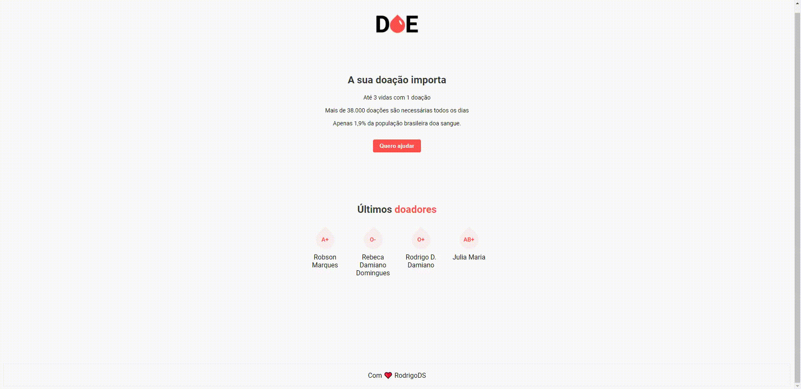

<h1 align="center">
  DOE
</h1>

<h1>
  
</h1>

## 📝 Detalhes do conteúdo
**Doe** é um simples sistema de cadastro para doadores de sangue desenvolvido através do treinamento ***"MaratonaDev"*** oferecedido pela **Rocketseat**. Foi um ótimo treinamento onde é possível adquirir conhecimentos de front-end (CSS) e backend utlizando nodejs e ferramentas como express, nodemon e nunjucks. Também contém no projeto configuração de banco de dados usando o PostgreSQL.

---

## 🚀 Tecnologias utilizadas
- Javascript
- CSS
- Node.js

---

## 📦 Dependências
- [Express](https://github.com/expressjs/express)
- [Nodemon](https://github.com/remy/nodemon)
- [Nunjucks](https://github.com/mozilla/nunjucks)

---

## 📁 Como baixar e rodar o projeto
```bash
    # para clonar o repositório
    $ git clone https://github.com/DigooDS/DOE.git

    # para entrar no diretório
    $ cd DOE

    # para instalar as dependências
    $ yarn install

    # para iniciar o servidor
    $ yarn start

```
- Em seguida, acessar dentro do navegador o **"localhost:3000"** para acessar a página principal (index.html).

---

<i>Desenvolvido por RodrigoDS</i> 🤓
